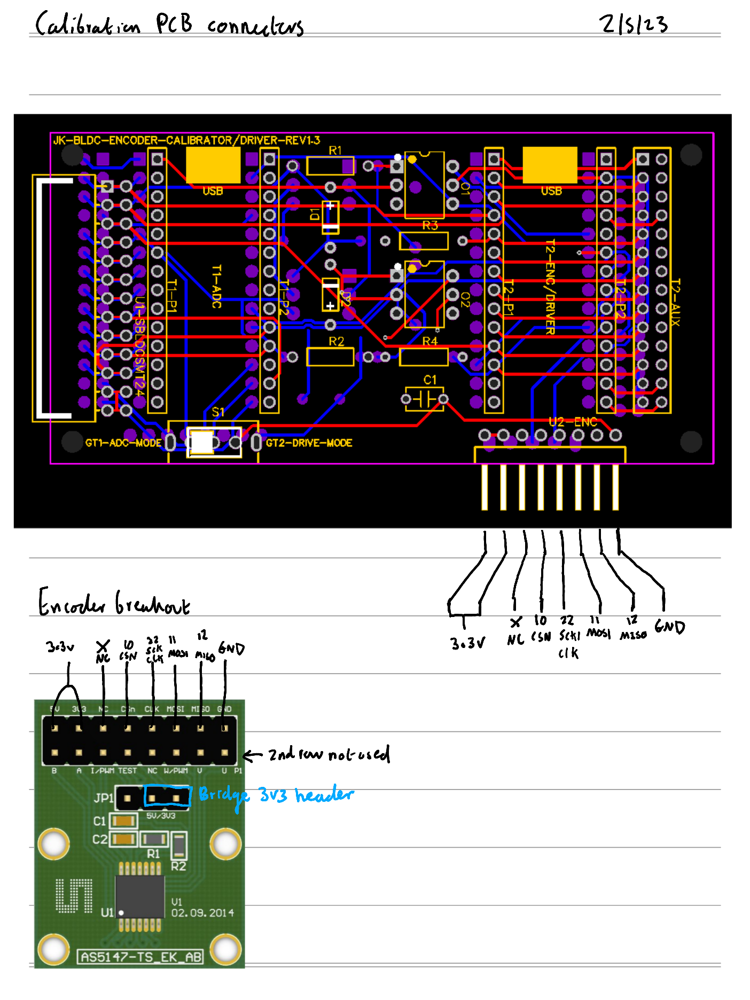

# DigitalRotaryEncoderSPI-AS5147P-teensy40

Driver for the AS5147P absolute digital encoder on the teensy40 platform.

## DigitalRotaryEncoderSPI/DualDigitalRotaryEncodersSPI usage example:

```
#include "lib/rotary/AS5147P/platform/teensy40/digital_rotary_encoder.cpp"
#include "lib/rotary/AS5147P/platform/teensy40/dual_digital_rotary_encoders.cpp"

kaepek::DigitalEncoderPinsSPI enc1_pins = kaepek::DigitalEncoderPinsSPI();
kaepek::DigitalEncoderPinsSPI enc2_pins = kaepek::DigitalEncoderPinsSPI();
kaepek::DigitalRotaryEncoderSPI enc1;
kaepek::DigitalRotaryEncoderSPI enc2;
kaepek::DualDigitalRotaryEncodersSPI dualenc;

void setup() {
  // Set encoder pins.
  enc_pins1.csn = 10;
  enc_pins1.miso = 12;
  enc_pins1.mosi = 11;
  enc_pins1.sck = 22;
  enc_pins2.csn = 14;
  enc_pins2.miso = 15;
  enc_pins2.mosi = 16;
  enc_pins2.sck = 17;

  // Init encoder classes.
  enc1 = kaepek::DigitalRotaryEncoderSPI(enc1_pins);
  enc2 = kaepek::DigitalRotaryEncoderSPI(enc2_pins);
  dualenc = kaepek::DualDigitalRotaryEncodersSPI(enc1, enc2);
}

void loop() {
    // Read and print enc1.
    Serial.println(enc1.read());
    // Read and print enc2.
    Serial.println(enc2.read());
    // Read enc1 and enc2 at the same time.
    kaepek::DualEncodersSensorValues values = dualenc.read();
    // Print the dual read values.
    Serial.println(values.enc1_val);
    Serial.println(values.enc2_val);
}
```

### Test:
- [DigitalRotaryEncoderSPI test](../../../../../test/rotary/AS5147P/platform/teensy40/encoder_test/encoder_test.ino)

## Rotary encoder sample validator usage example:

```
#include "lib/rotary/AS5147P/platform/teensy40/digital_rotary_encoder.cpp"
#include "lib/rotary/generic/rotary_encoder_sample_validator.cpp"

/**
* Example extension to the RotaryEncoderSampleValidator class:
*
* An electronic speed controller could be implemented: post_sample_logic could do PWM switching
* based on encoder's validated position and post_fault_logic could deal with faults by switching off the PWM pins.
*/
namespace kaepek
{
  class DemoESC : public RotaryEncoderSampleValidator
  {
  public:
    // Default constuctor.
    DemoESC() : RotaryEncoderSampleValidator()
    {
    }

    // Constructor with parameters.
    DemoESC(DigitalRotaryEncoderSPI encoder, float sample_period_microseconds) : RotaryEncoderSampleValidator(encoder, sample_period_microseconds)
    {
    }

    void post_sample_logic(uint32_t encoder_value)
    {
      // Set PWM pin state for this commutation, based upon the current validated encoder position <encoder_value>.
    }

    void post_fault_logic(RotaryEncoderSampleValidator::Fault fault_code)
    {
      // Turn off motor by setting PWM pins off.

      // Do something fault specific based on the <fault_code>.
      if (fault_code == RotaryEncoderSampleValidator::Fault::SkippedSteps)
      {
      }
      else if (fault_code == RotaryEncoderSampleValidator::Fault::WrongDirection)
      {
      }
    }
  };
}

// Define encoder pin config struct.
kaepek::DigitalEncoderPinsSPI enc_pins = kaepek::DigitalEncoderPinsSPI();
// Define the encoder.
kaepek::DigitalRotaryEncoderSPI enc;
// Define the encoder sampler.
kaepek::DemoESC sampler;
// Define bool for knowing if the sampler started is a good state.
bool started_ok;

void setup()
{
  // Setup the encoder pin configuration.
  enc_pins.csn = 10;
  enc_pins.miso = 12;
  enc_pins.mosi = 11;
  enc_pins.sck = 22;
  
  // Initalise the encoder with giving it the pin configuration.
  enc = kaepek::DigitalRotaryEncoderSPI(enc_pins);

  // Initalise the encoder sampler.
  sampler = kaepek::DemoESC(enc, 2.0); // 2us (micro) sample period

  // Allow skipping ahead a maximum value of 4.0, in terms of the read encoder value measurement, before a skip is detected.
  sampler.set_skip_tolerance(4.0);
  // Only allow skipping ahead twice before faulting.
  sampler.set_skip_threshold(2);

  // To enable direction enforcement, invoke the sampler set_direction_enforcement method with a true argument.
  sampler.set_direction_enforcement(true);
  // Set direction validation to be Clockwise (otherwise you could choose 'CounterClockwise').
  sampler.set_direction(kaepek::RotaryEncoderSampleValidator::Direction::Clockwise);
  // Specify the maximum encoder value change allowed in the wrong direction, before wrong direction motion is detected.
  sampler.set_wrong_way_tolerance((double)kaepek::DigitalRotaryEncoderSPI::encoder_divisions / (14.0)); // For a 14 pole motor.
  // Allow two detections of motion in wrong direction before faulting.
  sampler.set_wrong_way_threshold(2);

  // To disable direction enforcement, invoke the sampler set_direction_enforcement method with a false argument.
  // sampler.set_direction_enforcement(false); // Nothing else, otherwise if set_direction, set_wrong_way_tolerance and/or set_wrong_way_threshold are invoked, they will be ignored silently.

  // Run setup procedure of the sampler. Note this will invoke the encoder's setup method and therefore it is unnecessary to do it explicitly on the encoder instance.
  sampler.setup();
  // Start sampling.
  started_ok = sampler.start();
}

// Main loop runs as frequently as it can.
void loop()
{
  if (started_ok == true)
  {
    // Check the encoder has a new sample.
    if (sampler.has_new_sample() == true)
    {
      // Define variables to store the sampled encoder value and the number of elapsed microseconds since the last samples retrieval.
      uint32_t encoder_value;
      uint32_t elapsed_micros_since_last_sample;
      // Fetch the stored values from the buffer.
      sampler.get_sample_and_elapsed_time(encoder_value, elapsed_micros_since_last_sample);
      // Do something else like speed computations etc.
    }
  }
  else {
    // If the sampler did not start in a good state, then print the configuration issues out via the serial port, by invoking the print_configuration_issues method of the sampler.
    sampler.print_configuration_issues();
    delayMicroseconds(10'000'000);
  }
}
```

### Test:

- [Encoder sample validator test](../../../../../test/rotary/AS5147P/platform/teensy40/encoder_sample_validator/encoder_sample_validator.ino)

## Connection for AS5147P if using the KAEPEK-CALIBRATION circuit:

[Circuit](https://github.com/kaepek/calibration/tree/master/circuits/calibration/circuit)



--------------------------------------------------------------------------
- [Parent README](../../README.md)